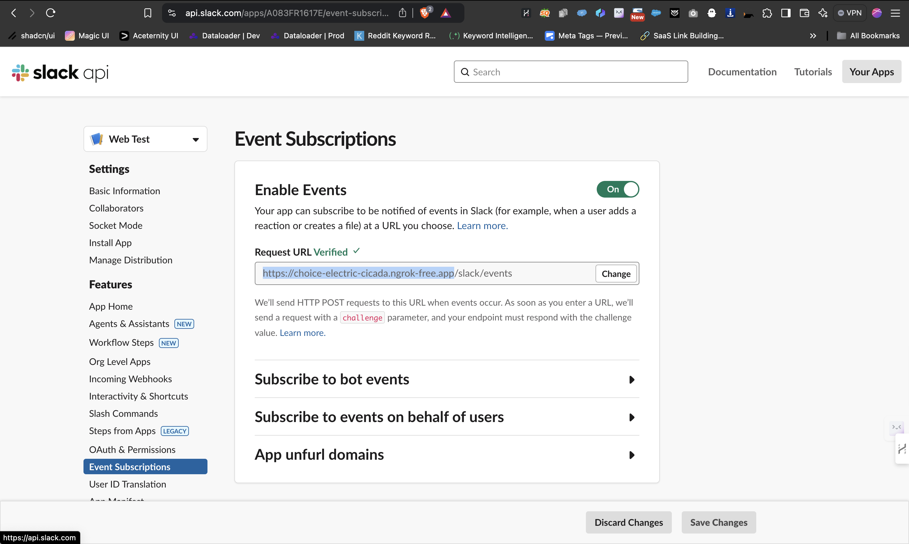

# Clientell GTM Engineer

## Description
This project is designed to scrape data from getclientell.com, load it into a vector database using **chromadb**, and retrieve it for further analysis. The main components of the project include:

- **webscraper.py**: A script that handles web scraping, extracting relevant data from specified web pages and saving it to a JSON file.
- **dbloader.py**: This script is responsible for loading the scraped data into a vector database.
- **chromadb**: A vector database that stores the scraped data in a format suitable for efficient retrieval and analysis.
- **System Prompts**: These are predefined instructions used to guide the data retrieval process, enhancing the interaction between the user and the system. They are dynamic and can be customized based on user input.
- **retriever.py**: A script that retrieves data from the database for analysis or display.
- **app.py**: This script runs the Flask web server, providing a web interface for interacting with the scraped data and retrieval functionalities.

## Installation Instructions
1. Clone the repository:
   ```bash
   git clone <repository-url>
   cd webembedder
   ```
2. Install the required packages:
   ```bash
   pip install -r requirements.txt
   ```

## Usage
- To run the web scraper:
  ```bash
  python webscraper.py
  ```
- To load data into the database:
  ```bash
  python dbloader.py
  ```

## Setting up ngrok for Flask Server
- To start the Flask server, run the following command:
  ```bash
  python app.py
  ```
- By default, the server will run on `http://127.0.0.1:5000/`. To expose this server to the internet, you need to use ngrok. Install ngrok if you haven't already, then run:
  ```bash
  ngrok http 5000
  ```
- This will give you a public URL that you can use to access your Flask server. Note down this URL.
- Go to your Slack App Dashboard and set the `Request URL` under `Event Subscriptions` to the ngrok URL you just generated. This will allow your Flask server to receive incoming webhooks from Slack. Example: ```{YOUR_NGROK_URL}/slack/events```



## Dependencies
- List of dependencies can be found in `requirements.txt`.

## Environment Variables
- `FLASK_DEBUG`: Set to `False` to disable debug mode in the Flask application. Default is `True`.
- `SLACK_BOT_TOKEN`: The token used to authenticate with the Slack API.
- `API_URL`: The URL of the API endpoint used for sending messages to Slack.
- `OPENAI_API_KEY`: The API key for accessing the OpenAI API.

```
SLACK_BOT_TOKEN=
API_URL=
OPENAI_API_KEY=
FLASK_DEBUG=
```